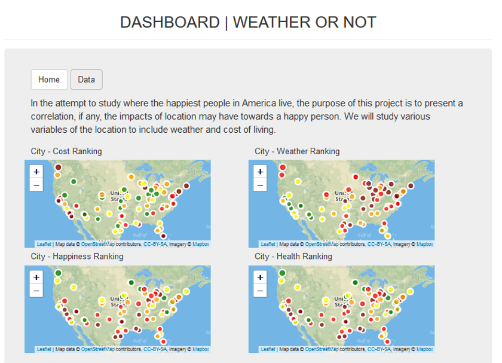
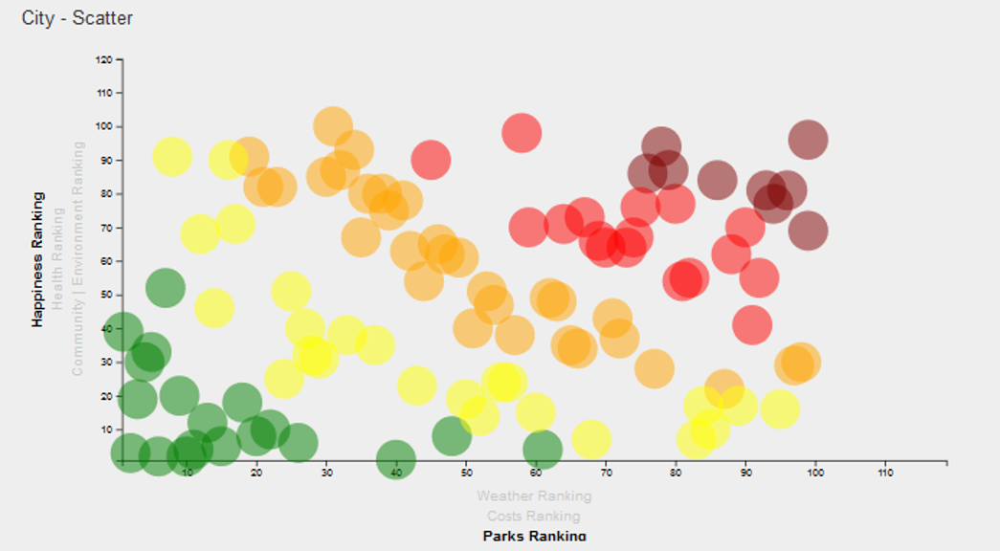

# Visualizing and Analyzing Best Places to Live (Wallethub

## Background

In this project, we analyzed the best places to live in the US based on numerous Wallethub rankings. The key factors examined were: Cost, Weather, Parks vs. Happiness, Health, Community. This app uses Python for app rendering and data wrangling, along with HTML and Javascript for the visualization. Data was stored and retrieved from MongoDB.

The data is presented visually and tabularly. The tabular data shows the raw ranking data from Wallethub as well as linear correlation (slope) measured between the major parameters. 

The four Leaflet Heatmaps show a visual comparison of cost, weather, health and happiness across the United States.

Additionally, a D3 scatter plot with variable axis parameters shows how the measures correlate with each other.
 
The color of each dot is the product of each axis ranking. The product of best rankings yields a low number, is colored green and located near the scatterplot origin.

Similarly, the product of worst rankings yields a high number, is colored maroon and is located furthest from the plot origin.

Numerical data tables are available by clicking the "Data" button at the top of the page.

## Code Execution
In Gitbash or CLI, type "python app.py"

